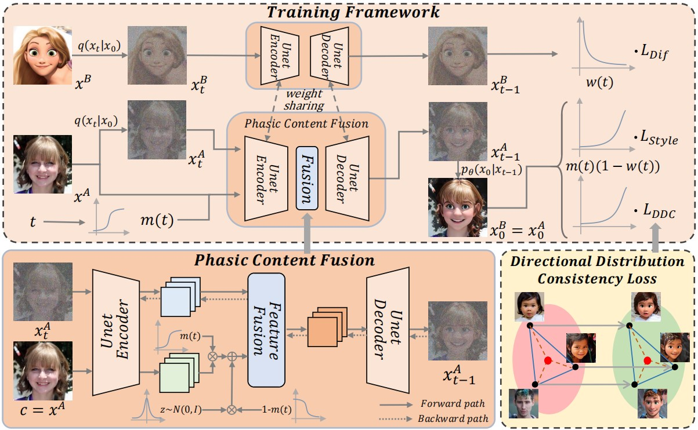

# Phasic Content Fusing Diffusion Model with Directional Distribution Consistency for Few-Shot Model Adaption (ICCV 2023)

###  [Paper](https://arxiv.org/abs/2309.03729)
<!-- <br> -->
[Teng Hu](https://github.com/sjtuplayer), [Jiangning Zhang](https://zhangzjn.github.io/), [Liang Liu](https://scholar.google.com/citations?hl=zh-CN&user=Kkg3IPMAAAAJ), [Ran Yi](https://yiranran.github.io/), Siqi Kou, [Haokun Zhu](https://github.com/zwandering), [Xu Chen](https://scholar.google.com/citations?hl=zh-CN&user=1621dVIAAAAJ), [Yabiao Wang](https://scholar.google.com/citations?hl=zh-CN&user=xiK4nFUAAAAJ), [Chengjie Wang](https://scholar.google.com/citations?hl=zh-CN&user=fqte5H4AAAAJ) and [Lizhuang Ma](https://dmcv.sjtu.edu.cn/) 
<!-- <br> -->



## Abstract
>Training a generative model with limited number of samples is a challenging task. Current methods primarily rely on few-shot model adaption to train the network. However, in scenarios where data is extremely limited (less than 10), the generative network tends to overfit and suffers from content degradation. To address these problems, we propose a novel phasic content fusing few-shot diffusion model with directional distribution consistency loss, which targets different learning objectives at distinct training stages of the diffusion model. Specifically, we design a phasic training strategy with phasic content fusion to help our model learn content and style information when t is large, and learn local details of target domain when t is small, leading to an improvement in the capture of content, style and local details. Furthermore, we introduce a novel directional distribution consistency loss that ensures the consistency between the generated and source distributions more efficiently and stably than the prior methods, preventing our model from overfitting. Finally, we propose a cross-domain structure guidance strategy that enhances structure consistency during domain adaptation. Theoretical analysis, qualitative and quantitative experiments demonstrate the superiority of our approach in few-shot generative model adaption tasks compared to state-of-the-art methods

This work has been accpected by ICCV 2023.


## Visualization Results

The follows are the results trained on Cartoon and Van Gogh painting dataset:


## Todo (Latest update: 2023/11/30)
- [x] **Release the training code
- [x] **Release the pretrained models and training data


## Training Steps


### Overview

This project is based on [denoising-diffusion-pytorch](https://github.com/lucidrains/denoising-diffusion-pytorch).

We show the training method of our model here.
The training process can be divided into four steps:

### (1) Prepare:


#### Install the dependencies:

```
pip install denoising_diffusion_pytorch==0.28.0
```

#### Download the few-shot target dataset 

The few-shot target dataset can be downloaded from [few-shot target dataset](https://drive.google.com/drive/folders/1VAJU5yEolmd2xAIUI7xvGNaHKBs4B7QX?usp=drive_link).


#### Download the pretrained diffusion model on FFHQ.
Both the pretrained diffusion model on FFHQ (`ffhq.pth`) 
and phasic content fusing diffusion model on FFHQ (`ffhq-recon.pth`) can be downloaded 
from [pretrained source-domain diffusion model](https://drive.google.com/drive/folders/1XTDbNEsDxfA8ZHIG9nFRTESxdOZrh5pZ?usp=sharing).


#### Or you can just train the two models on the source dataset

Note: If you have download the pretrained model `ffhq-recon.pth`, you can skip the following 2 steps


Step 1: To train the basic diffusion model, you can run the following code
```
python3 train.py --data_path=path_to_dataset 
```

Step 2: After the basic diffusion model is obtained, you can train phasic content fusing module by:
```
python3 train-recon.py --data_path=$path_to_dataset --ckpt=$path_to_basic_diffusion_checkpoint
```
where `$path_to_basic_diffusion_checkpoint` is the path to the pretrained diffusion model 
on the source domain.

### (2) Train the whole model on both the source and target dataset 


Before the last step, there is some data to prepare. Our Directional Distribution Consistency Loss relies
on the image features extracted from CLIP model. So, you should extract the image features from the source dataset and target dataset before model adaption.
You can run the following code to encode the images:
```
python3 feature-extractor.py --data_path=$path_to_source_dataset --save_path=$source_feature_path
python3 feature-extractor.py --data_path=$path_to_target_dataset --save_path=$target_feature_path
```

Finally, with the pretrained phasic content fusing model `ffhq-recon.pth` from (1)-step2 or the google link, you train the whole model on both the source and target dataset:
```
python3 train-whole.py 
--source_path=$path_to_source_dataset 
--target_path=$path_to_target_dataset 
--source_feature_path=$source_feature_path
--target_feature_path=$target_feature_path
--ckpt_path=ffhq-recon.pth
```

Note that since different target domains have different domain gaps with the source domain, the training time is not fixed.
You can check the output image in the training process. Once it is good enough, you can stop training. In our experience, for the style 
like cartoon and VanGogh_face, 300-500 iterations are enough while for Sketches, 3000 iterations work better.


## Inference

There are some pretrained checkpoints you can directly downloaded from:
[target-domain diffusion model](https://drive.google.com/drive/folders/1luEH2SrETjj5rfZcmIxibhwBVBNA5S8F?usp=sharing) 
which contains:

| Source Domain | Target Domain                  |
|---------------|--------------------------------|
| FFHQ          | Sketch, Cartoon, VanGogh_face  |

[//]: # (| Church        | VanGogh_village, Haunted_house |)


With the pretrained checkpoints, you can put transfer the images from source domain
to target domain by running:

```
python3 generate.py --ckpt_path=$path_to_the_checkpoints --img_path=$source_img_path
```
where `$source_img_path` is the path to the directory which contains all the test images.
If you hope to generate the target domain images, the simplest way is to generate source-domain images 
into `$source_img_path`, and then transfer these images to the target domain.

There are several outputs in different diffusion step, you can choose the best one as the result. And if the content
is not kept so well, you can decrease the number of  `filter_size` and `guid_step` in `generate.py`.


## Citation

If you find this code helpful for your research, please cite:

```
@inproceedings{hu2023phasic,
  title={Phasic Content Fusing Diffusion Model with Directional Distribution Consistency for Few-Shot Model Adaption},
  author={Hu, Teng and Zhang, Jiangning and Liu, Liang and Yi, Ran and Kou, Siqi and Zhu, Haokun and Chen, Xu and Wang, Yabiao and Wang, Chengjie and Ma, Lizhuang},
  booktitle={Proceedings of the IEEE/CVF International Conference on Computer Vision},
  pages={2406--2415},
  year={2023}
}
```